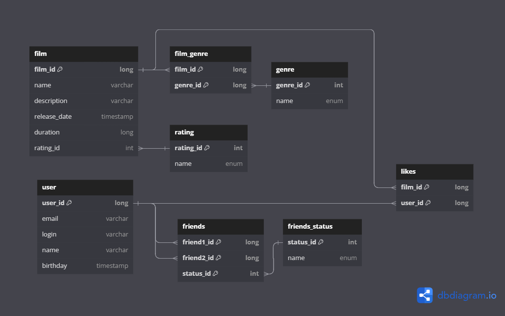

# java-filmorate
Template repository for Filmorate project.

## Схема базы данных


## Описание таблиц:

### film
Содержит данные о фильмах. 

Таблица включает такие поля:
* первичный ключ _film_id_ — идентификатор фильма;
* _name_ — название фильма;
* _description_ — описание фильма;
* _release_date_ — дата экранизации фильма;
* _duration_ — продолжительность фильма;
* внешний ключ _rating_id_ (ссылается на таблицу _rating_) — идентификатор рейтинга фильма. 

### rating
Содержит информацию о рейтингах.

Таблица включает поля:
* первичный ключ _rating_id_ — идентификатор рейтинга фильма;
* _name_ — обозначение рейтинга фильма.

### genre
Содержит данные о жанрах.

Таблица включает такие поля:
* первичный ключ _genre_id_ — идентификатор жанра;
* _name_ — название жанра.

### film_genre
Содержит информацию о жанрах фильмов из таблицы _film_.  
Таблица создана для реализации связи многие-ко-многим между таблицами _film_ и _genre_.

Таблица включает поля:
* внешний ключ _film_id_ (ссылается на таблицу _film_) — идентификатор фильма;
* внешний ключ _genre_id_ (ссылается на таблицу _genre_) — идентификатор жанра.  

<u>Первичный ключ состоит из двух полей: _film_id_ и _genre_id_.</u>

### user
Содержит данные о пользователях.

Таблица включает такие поля:
* первичный ключ _user_id_ — идентификатор пользователя;
* _email_ — электронная почта пользователя;
* _login_ — логин пользователя;
* _name_ — имя пользователя;
* _birthday_ — дата рождения пользователя.

### likes
Содержит информацию о лайках к фильмам из таблицы _film_.  
Таблица создана для реализации связи многие-ко-многим между таблицами _film_ и _user_.

Таблица включает поля:
* внешний ключ _film_id_ (ссылается на таблицу _film_) — идентификатор фильма;
* внешний ключ _user_id_ (ссылается на таблицу _user_) — идентификатор пользователя.  

<u>Первичный ключ состоит из двух полей: _film_id_ и _user_id_.</u>

### friends
Содержит информацию о друзьях из таблицы _user_.  

Таблица включает поля:
* внешний ключ _friend1_id_ (ссылается на таблицу _user_) — идентификатор пользователя;
* внешний ключ _friend2_id_ (ссылается на таблицу _user_) — пользователя;
* внешний ключ _status_id_ (ссылается на таблицу _friends_status_) - идентификатор статуса дружбы.
  
<u>Первичный ключ состоит из трех полей: _friend1_id_, _friend2_id_ и _status_id_.</u>


### friends_status
Содержит информацию о статусах дружбы пользователей.

Таблица включает поля:
* первичный ключ _status_id_ — идентификатор статуса дружбы;
* _name_ — название статуса дружбы.


## Примеры запросов SELECT на языке SQL для модели User

### 1. Найти всех пользователей  

**findAll()**
```
SELECT *
FROM user
```

### 2. Найти пользователя по id

**findById(long userId)**
```
SELECT *
FROM user
WHERE user_id = {userId};
```

### 3. Найти друзей пользователя  

**findFriends(long userId)**
```
SELECT u2.*
FROM user AS u1
JOIN friends AS f ON u1.user_id = f.friend1_id
JOIN user AS u2 ON f.friend2_id = u2.user_id
JOIN friends_status AS s ON f.status_id = s.status_id
WHERE u1.useer_id = {userId} AND s.status = 'accepted';
```

### 4. Найти общих друзей двух пользователей  

**findCommonFriends(long userId, long otherId)**
```
SELECT u2.*
FROM user AS u1
JOIN friends AS f ON u1.user_id = f.friend1_id
JOIN user AS u2 ON f.friend2_id = u2.user_id
JOIN friends_status AS s ON f.status_id = s.status_id
WHERE u1.user_id = {userId} 
      AND s.status = 'accepted'
      AND u2.user_id IN (SELECT ou2.id
                    FROM user AS ou1
                    JOIN friends AS of ON ou1.user_id = of.friend1_id
                    JOIN user AS ou2 ON of.friend2_id = ou2.user_id
                    JOIN status AS os ON of.status_id = os.status_id
                    WHERE ou1.user_id = {otherId} 
                          AND os.status = 'accepted');
```